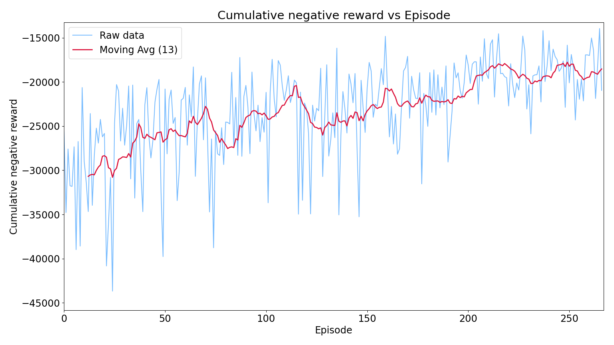
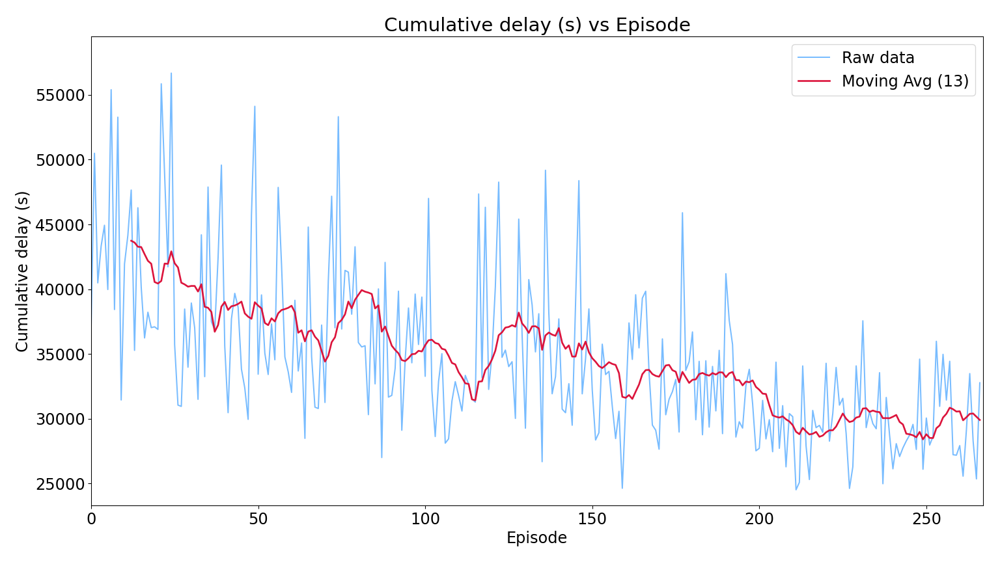
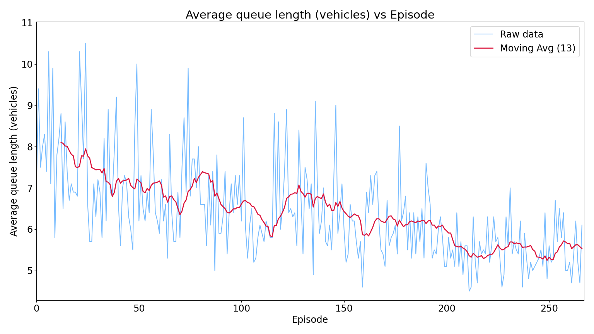

# Robust Deep Q-Learning Traffic Signal Controller

An advanced, PyTorch-based Deep Q-Learning (DQN) agent that autonomously optimizes traffic light phases for a complex 4-way intersection using SUMO (Simulation of Urban MObility). 

Designed for robust traffic flow, lower wait times, and detailed analytics, this system natively balances queues and dynamically converges early via an intelligent patience-based halting mechanism.

## High-Level Architecture
This implementation discretizes the environment into 80 binary state cells for incoming traffic, allowing precise representation of lane occupancy. The agent directly controls 4 fixed phase actions:
1. North-South Straight/Right
2. North-South Left
3. East-West Straight/Right
4. East-West Left

It features:
- **Optimized Hyper-parameters**: Configurable deep networks (`[256]` width layers, optimized `batch_size`) targeting rapid stable convergence.
- **Experience Replay Buffer**: Ensures randomized sampling, un-correlating successive actions to prevent compounding structural bias.
- **Dynamic Early Stopping**: Constantly monitors the simulation queue cumulative wait times. To avoid overfitting, it automatically halts training if convergence is reached over a multi-episode window.

## Training Analytics
The pipeline automatically generates evaluation curves to monitor the DQN Agent’s progress across episodic checkpoints.

### Reward Optimization
The cumulative negative reward per episode over the training timeline.
  

### Cumulative Wait Time Delay
Total combined delay in seconds across all cars, minimizing heavily over time as the agent masters intersection logic.
  

### Queue Length Reduction
The average queue length directly correlating to the intersection bottleneck impact.
  

## Setup Requirements

- Python 3.13+ (managed via `uv` or native)
- [SUMO & SUMO-GUI](https://sumo.dlr.de/docs/Downloads.php) installed natively. *(The agent automatically hooks to `C:\Program Files (x86)\Eclipse\Sumo` if `SUMO_HOME` is missing).*
- PyTorch

### Initialization
```bash
uv sync
```

## Running the Project

To let the dynamic DQN agent train (which will early-stop upon confirmed convergence):
```bash
uv run tlcs train
```

To test the model in the GUI:
```bash
uv run tlcs test --model-path model/ --test-name evaluation_run
```
