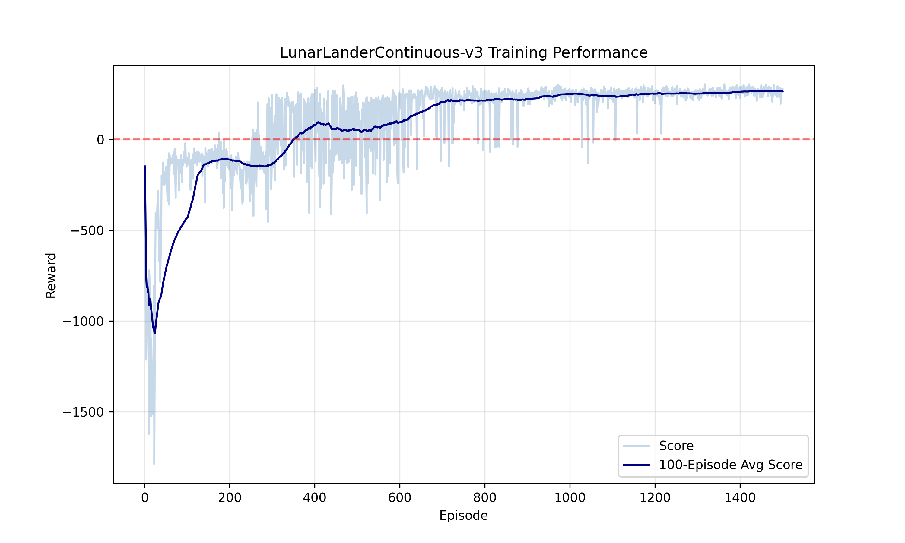

# LunarLander Continuous DDPG 🚀

Custom, high-performance implementation of **Deep Deterministic Policy Gradient (DDPG)** for the `LunarLanderContinuous-v3` environment. No boilerplate, no nonsense—just a clean and efficient agent that learns to land perfectly.

## 📊 Final Training Results (1500 / 1500 Episodes) - COMPLETED 🚀

The agent has successfully completed the full training cycle of **1500 episodes**. It has mastered the landing maneuvers with a final rolling average score of **~267**, which indicates the environment is fully solved.

### 📈 Final Reward Curve


The reward curve shows a smooth and steady convergence. Starting from purely random attempts, the DDPG agent learned the underlying physics of thrust and orientation to achieve a stable peak around episode 1100, maintaining it until the end.

### 🎥 Watching it Fly


This GIF displays the successful touchdown performance of the DDPG agent. Clean, stable, and efficient.

## 🚀 Key Features

- **Built from the Ground Up**: No recycled code here—everything from the replay buffer to the target updates is custom.
- **Cool Terminal UI**: Includes a `rich`-based progress bar so you can see exactly how the agent is doing without cluttering your screen.
- **Streamlit Dashboard**: A full web dashboard for real-time performance tracking with Plotly.

## 🛠 Usage

### ⚙️ Installation
Make sure you have `gymnasium[box2d]`, `torch`, `rich`, `plotly`, and `streamlit` installed.

### 🏋️ Train the Agent
To start fresh:
```bash
python train_cli.py --episodes 1500
```

To resume if you stopped:
```bash
python train_cli.py --episodes 1500 --load
```
*Tip: Hit `Ctrl+C` anytime; it’ll auto-save the current weights.*

### 🌕 Enjoy the Best Run
Check out how your best model performs:
```bash
python enjoy.py --episodes 5
```

### 📊 Dashboard
Launch the web interface:
```bash
streamlit run app.py
```

---
*Developed with a focus on efficiency and clean RL architectures.*
